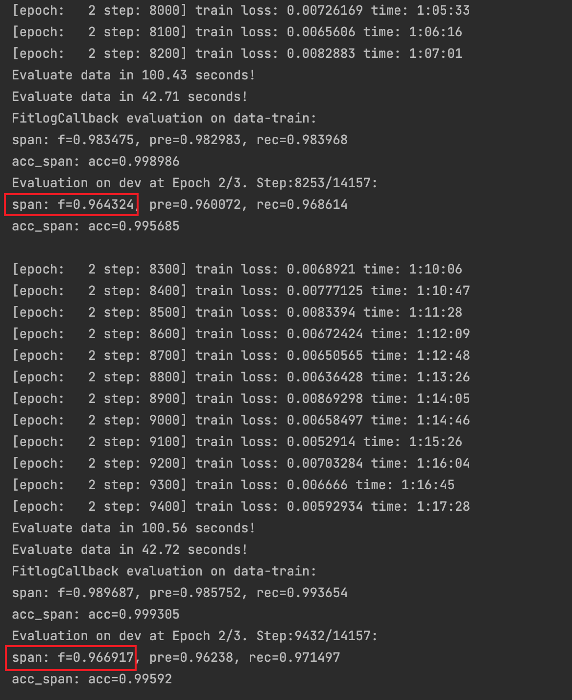

# MarkBERT: Marking Word Boundaries Improves Chinese BERT


*[MarkBERT: Marking Word Boundaries Improves Chinese BERT](https://arxiv.org/abs/2203.06378)*

### Training and test script
```python
bash fastnlp-ner/run_ner.sh
```
This training example is for msra-ner. The dataset can be found in the folder msra-mark. The checkpoints can be downloaded from [markbert](https://drive.google.com/drive/folders/1RP88vvaLmPkSyjQO9Chc2-FVSw-4fYNn?usp=sharing) and [markbert_pos](https://drive.google.com/drive/folders/1x42RUWAX0Ajw4No1BC-hO3ZXjgAmUW3E?usp=sharing). We give out a result after 1.5-hours training using this script as follows:
.

### Other description
We add markers in the data preprocess phase during fine-tuning therefore the usage of MarkBERT is simple.
We use *[TextSmart tookit](https://ai.tencent.com/ailab/nlp/texsmart/zh/index.html)* to do segmentation and pos-tagging in preprocessing the data.


In the CLUE experiments: You can simply use the tokenizer in run_glue.py to replace BERT tokenizers and run fine-tuning experiments in any huggingface transformers versions.
You only need to set the encode_type in the MarkBertTokenizer:
When encode_type=1, the tokenizer will add special marker between words, and when encode_type=2, the tokenizer will add postag markers between words.
You MUST follow the dataset sample to preprocess the corresponding fine-tuning dataset.


In the NER experiments: You need to insert markers manually since the dataset is char-level (as seen in the data_sample.txt file), then you can use MarkBERT just like normal BERT-models.


Without using the MarkBERT tokenizer, you can also use MarkBERT checkpoints as an improved version of BERT-BASE.


We also provide a FastNLP version to quickly test the effectiveness of MarkBERT.

You can install the fastnlp and fitlog packages and enter the fastnlp folder to run the bash.

You need to prepare your train and dev file and assign the path in fastnlp-ner/run_ner.py line21-22 and assign the model checkpoint path in the fastnlp-ner/run_ner.sh 

If you encounter any errors, you may find help in https://github.com/LeeSureman/Flat-Lattice-Transformer .